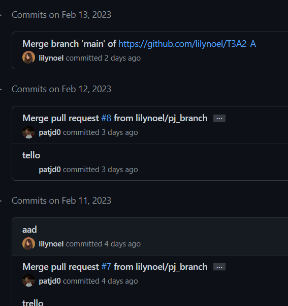
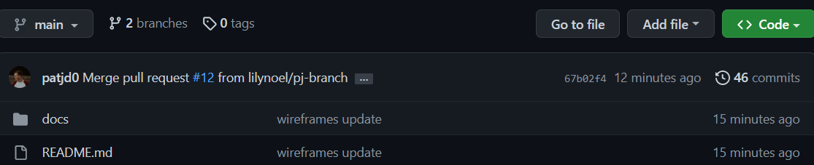
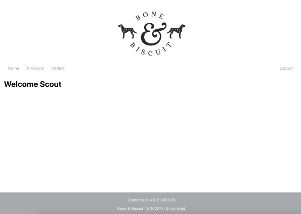

# T3A2-B • Full Stack App (Part B)

### Application Name
Bone & Biscuit

### Deployed App
[T3A2-B | Bone & Biscuit - Full Stack App](https://github.com/lilynoel/T3A2-B) <!-- update link once deployed -->

### GitHub Repo
[T3A2-B | GitHub Repository](https://github.com/lilynoel/T3A2-B)

### Developer Team
PJ & Lily Noël

<!-- ** Reminder to import contents of Part A README here. ** -->

## R1. Tech Stack 
Bone & Biscuit was created using the following tech stack:
- Rails
- React.js
- netlify
- Heroku

## R2. Code Requirements 

## Libraries 

### react-router-dom 
- This was used to provide routing capabilities in our app, React Router DOM allows us to define client-side routes within the React components.

### axios 
- This library was used to make requests to the API from the frontend to the backend.

### jsonwebtoken 
- This was used to authorize users for extra security by assigning tokens to users represent claims being transferred between the front and back ends of the application.

### cors
- Cross-Origin Resource Sharing was used is in order to allows web browsers to make cross-domain HTTP requests in a secure manner.

## R3. Employ and utilise proper source control

 

## R4. Demonstrate your ability to work in a team
We decided a Trello board was the best management methodology for our project giving us the ability to set deadlines and individual tasks catered for both our strengths and weaknesses.

<!-->
## R5. Produce a working application that meets client and user needs
-->

## R6. Deploy the application to a cloud hosting service

### Back-end
https://bone-and-biscuit.herokuapp.com

### Front-end
https://bone-and-biscuit.netlify.app/

## R7. Produce an application with an intuitive user interface

Home Page

 

Products Page

 

Order Page

## R8. User Testing

### Manual testing

### Development testing

JWT token test

 

Retrieve user details 

 

### Production environment

Automated tests

 

<h5 align="center">

Bone & Biscuit. © 2023 PJ & Lily Noël.

</h5>