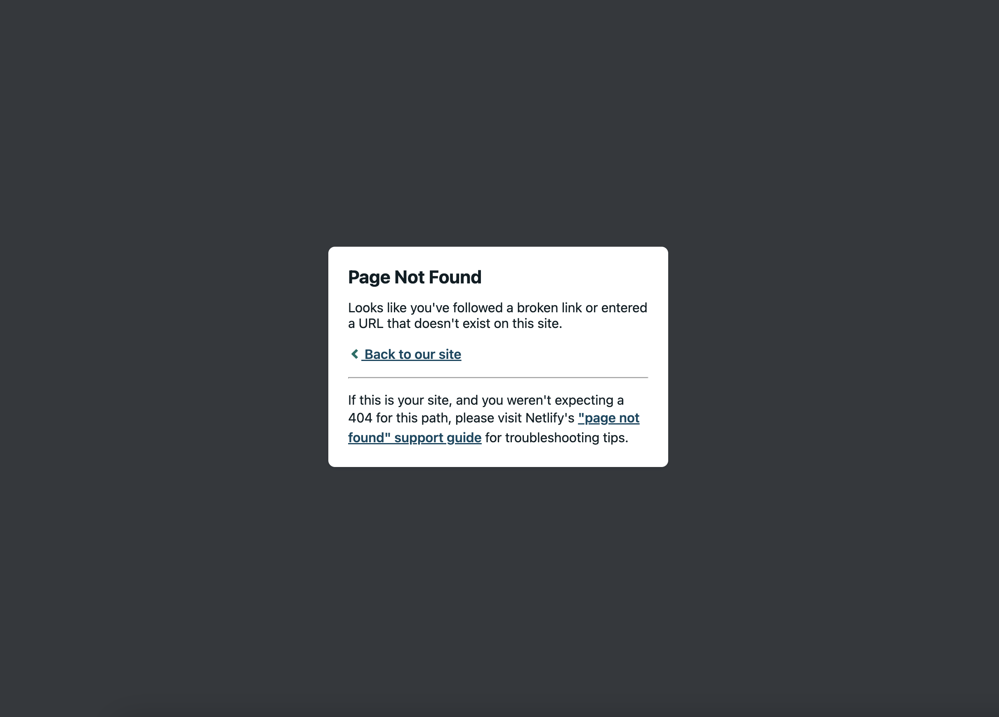

# T3A2-B • Full Stack App (Part B)

#### Application Name
Bone & Biscuit

#### Deployed App
[T3A2-B | Bone & Biscuit - Full Stack App | Netlify](https://bone-and-biscuit.netlify.app/) <!-- update link once deployed -->

#### GitHub Repo
[T3A2-B | GitHub Repository](https://github.com/lilynoel/T3A2-B)

#### Developer Team
PJ & Lily Noël

## Description
Bone & Biscuit is an online store for a local canine bakery specializing in baked biscuits and treats for dogs. 

#### Purpose
- The purpose of this application is to provide a service for dog owners to both seek out and place an order for artisan dog treats. Bone & Biscuit offers an online ordering system where consumers may place an order for collection.  Payments are not handled by the application. Payment is made on collection of the product in store. 

#### Functionality / Features

##### Guest users

- User sign up / register
- View products 

##### Signed in users

- User sign up / login 
- View products
- Place order

##### Admin

- Create new products listing
- Edit product listings
- Destroy product listings
- Action orders 
- Update orders 
- View orders

#### Target audience 
This application is geared towards consumers looking to place an online order of artisan dog treats which they can then pickup / process payment at the store's physical location. 

#### Tech Stack & Code Requirements
This application was built using Rails 7.0.4.2, Ruby 3.1.1, React.js, JavaScript, HTML & CSS. The database used is PostgresQL and the app is deployed with netlify for front-end and Heroku for the back-end. We plan to host our images using Wix and ImageBB.

##### Source Control

- Github
- Git

##### Project Management & Delegation
- Trello

##### Documentation
- Canva
- Miro
- Google Sheets
- Drawio

##### Image Hosting
- Image BB
- Wix

##### Deployment
- [Netlify - Front End](https://bone-and-biscuit.netlify.app/)
- [Heroku - Back End](https://bone-and-biscuit.herokuapp.com)

  
## Libraries 

##### react-router-dom 
- This was used to provide routing capabilities in our app, React Router DOM allows us to define client-side routes within the React components.

##### axios 
- This library was used to make requests to the API from the frontend to the backend.

##### jsonwebtoken 
- This was used to authorize users for extra security by assigning tokens to users represent claims being transferred between the front and back ends of the application.

##### cors
- Cross-Origin Resource Sharing was used is in order to allows web browsers to make cross-domain HTTP requests in a secure manner.

## Produce a working application that meets client and user needs
Although simple in its interface, Bone & Biscuit is a functional application that meets the needs of the clients and users of its niche. The application successfully processes and authenticates user registration and  login/ logout functions. Users are able to view available products and place an order when logged in.

Logged in users also have the capability of viewing their own orders the corresponding order status. Admin users can manage all orders and listings (uupload, edit, delete).

## User Interface

<h4 align="center">

 Home Page 

Products Page 

Order Page   

## User Testing

#### Manual testing

#### Development testing

JWT token test

 

Retrieve user details 

 

#### Production environment

Automated tests

## Dataflow Diagram

## Application Architecture Diagram 

## User Stories 
In the context of this application, users will be categorized into "Admin user", "Guest users" and "Members".

#### Admin user
The goal of an admin user is to update available products and quantities and to process orders.

- As an admin user, its important that I can post, edit, delete and view my listings and that no one else can access those features on my product listings beyond viewing and ordering. 
 

- As an admin user it is important that this application offers the capabilities for me to update and adjust quantities as I replenish my stock of baked goods and to ensure that stock numbers are accurate + the ability to make changes to stock numbers where necessary. 

#### Guest users
The goal of a guest user is to view the menu of available baked goods and their corresponding prices and to locate address and contact information for Bone & Biscuit's storefront. 
 

- As a guest or visitor to the Bone & Biscuit web application, I'd like to have the option of navigating the site seamlessly, have an understanding of what the application does / it's purpose and experience some of the app's features such as viewing a product listing. 
 

- The option to sign up / register is important as a guest or visitor to the application. If I enjoy my preliminary experience of the application, and it aligns with my needs I will then expect the capability of registering to the application's services to place an order. 
  
#### Members
The goal of a member in addition to the guest user goals, is to place an online order of freshly baked treats for my dog that I can conveniently collect at the Bone & Biscuit bakery location and to also view my own orders. 
 

- Members have access to the website in its full state as per the guest user  experience  with the added ability to reserve baked goods for pickup and to view their existing orders & order status. 

## Bugs
- The update order status function worked locally during development however is a known bug in the deployed application presenting as outlined below.
  

## Wireframes

<h4 align="center">

Home screen | Signed in 
 

Home screen | Guest user 
 

Product page | Signed in 
 

Product page | Guest user 
 

Product page | Admin user
 

Item page | User
 

Item page | Guest user
 

Item page | Admin user
 

Sign in page
 

Sign up page 
 

</h4>

## Team work • Agile Project Management Methodology | Trello

<h4 align="center">

 

 

 

 

 

</h4>

#

<h5 align="center">

Bone & Biscuit. © 2023 PJ & Lily Noël.

</h5>